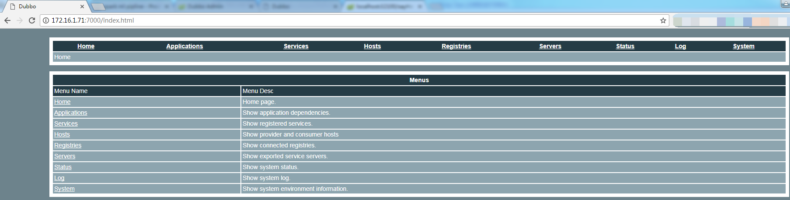
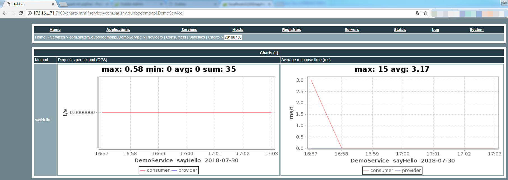

# dubbo-monitor-simple

统计数据

`Home > Services > com.sauzny.dubbodemoapi.DemoService > Providers | Consumers | Statistics | Charts > 
20180730
`

`Statistics` `Charts`，静态数据，图表展示，这个感觉延迟比较大，分钟级别的吧

## 一、下载源代码

https://github.com/apache/incubator-dubbo-ops

## 二、修改

#### 2.1 解决问题：页面菜单缺少 `Applications` `Services` `Hosts`
```
/dubbo-monitor-simple/src/main/resources/META-INF/dubbo/internal/com.alibaba.dubbo.container.Container 下增加
jetty-monitor=com.alibaba.dubbo.monitor.simple.container.JettyContainer

dubbo.properties下修改
dubbo.container=log4j,spring,registry,jetty-monitor
```

#### 2.2 其他配置

dubbo.properties中按照实际情况修改

- `dubbo.registry.address`，zk地址
- `dubbo.jetty.directory`，jetty目录

我的完整配置

```js
#dubbo.container=log4j,spring,registry,jetty
dubbo.container=log4j,spring,registry,jetty-monitor
dubbo.application.name=simple-monitor
dubbo.application.owner=dubbo
#dubbo.registry.address=multicast://224.5.6.7:1234
# 根据使用的注册中心配置，此处使用zookeeper
dubbo.registry.address=zookeeper://192.168.73.201:2181?backup=192.168.73.202:2181,192.168.73.203:2181
#dubbo.registry.address=redis://127.0.0.1:6379
# 配合dubbo-registry-simple项目使用，我不用这个
#dubbo.registry.address=dubbo://127.0.0.1:9090
dubbo.protocol.port=7070
dubbo.jetty.port=7000
# 这个目录需要手动创建
dubbo.jetty.directory=E:/temp/dubbo/monitor
# 自动创建charts目录，必须放在jetty.directory下，否则页面无法访问
dubbo.charts.directory=${dubbo.jetty.directory}/charts
# 自动创建statistics目录
dubbo.statistics.directory=${dubbo.jetty.directory}/statistics
dubbo.log4j.file=logs/dubbo-monitor-simple.log
dubbo.log4j.level=WARN
```

#### 2.3 解决问题：无法看到图（charts）

- dubbo-simple-monitor配置文件中`dubbo.jetty.directory`中指明的目录需要手动创建
- 我们需要监控的服务在配置dubbo时要加入 `<dubbo:monitor protocol="registry"/>` 这项配置

### 三、打包运行

`mvn install` 生成 `dubbo-monitor-simple-2.0.0-assembly.tar.gz`

解压之后，目录
- assembly.bin
- conf
- lib

`assembly.bin` 中的 `sh` 文件，默认 `ff=dos`，需要自己修改为 `unix`

```
vim start.sh
:set ff=unix
wq
```

我修改了这四个文件
```
vim dump.sh
vim restart.sh
vim start.sh
vim stop.sh
```

启动命令 `./start.sh`

访问：http://172.16.1.71:7000/



